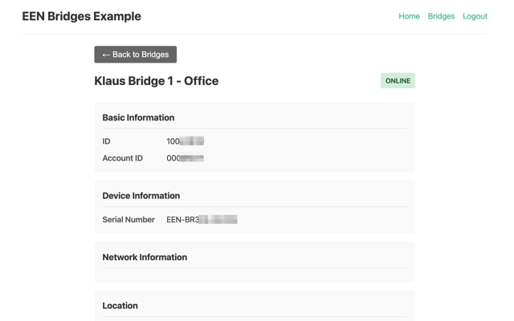

# EEN API Toolkit - Vue Bridges Example

A Vue 3 example demonstrating how to list and view EEN bridge devices using the een-api-toolkit.



## Features Demonstrated

- OAuth authentication flow (login, callback, logout)
- Protected routes with navigation guards
- `getBridges()` function for listing bridges with pagination
- `getBridge()` function for fetching bridge details
- Status filtering (online, offline, error, idle)
- Bridge card grid with status badges
- Detailed bridge view with device info and network info

## APIs Used

- `getBridges()` - List bridges with filtering and pagination
- `getBridge()` - Get single bridge by ID
- `useAuthStore()` - Authentication state management
- `initEenToolkit()` - Toolkit initialization

## Setup

### Prerequisites

1. **Start the OAuth proxy** (required for authentication):

   The OAuth proxy is a separate project that handles token management securely.
   Clone and run it from: https://github.com/klaushofrichter/een-oauth-proxy

   ```bash
   # In a separate terminal, from the een-oauth-proxy directory
   npm install
   npm run dev
   ```

   The proxy should be running at `http://localhost:8787`.

### Example Setup

All commands below should be run from this example directory (`examples/vue-bridges/`):

2. Copy the environment file:
   ```bash
   # From examples/vue-bridges/
   cp .env.example .env
   ```

3. Edit `.env` with your EEN credentials:
   ```env
   VITE_EEN_CLIENT_ID=your-client-id
   VITE_PROXY_URL=http://localhost:8787
   # DO NOT change the redirect URI - EEN IDP only permits this URL
   VITE_REDIRECT_URI=http://127.0.0.1:3333
   ```

4. Install dependencies and start:
   ```bash
   # From examples/vue-bridges/
   npm install
   npm run dev
   ```

5. Open http://127.0.0.1:3333 in your browser.

**Important:** The EEN Identity Provider only permits `http://127.0.0.1:3333` as the OAuth redirect URI. Do not use `localhost` or other ports.

## Project Structure

```
src/
├── main.ts          # App entry, toolkit initialization
├── App.vue          # Root component with navigation
├── router/
│   └── index.ts     # Vue Router with auth guards
└── views/
    ├── Home.vue     # Home page with login prompt
    ├── Login.vue    # OAuth login redirect
    ├── Callback.vue # OAuth callback handler
    ├── Bridges.vue  # Bridge list with filtering
    ├── BridgeDetail.vue # Single bridge details
    └── Logout.vue   # Logout handler
```

## Key Code Examples

### Listing Bridges with Filtering (Bridges.vue)

```typescript
import { getBridges, type Bridge, type ListBridgesParams } from 'een-api-toolkit'

const params = ref<ListBridgesParams>({
  pageSize: 20,
  include: ['deviceInfo', 'status', 'networkInfo']
})

async function fetchBridges() {
  const result = await getBridges(params.value)
  if (result.error) {
    error.value = result.error
  } else {
    bridges.value = result.data.results
    nextPageToken.value = result.data.nextPageToken
  }
}
```

### Fetching Bridge Details (BridgeDetail.vue)

```typescript
import { getBridge } from 'een-api-toolkit'

const result = await getBridge(bridgeId, {
  include: ['deviceInfo', 'status', 'networkInfo']
})

if (result.error) {
  error.value = result.error
} else {
  bridge.value = result.data
}
```
