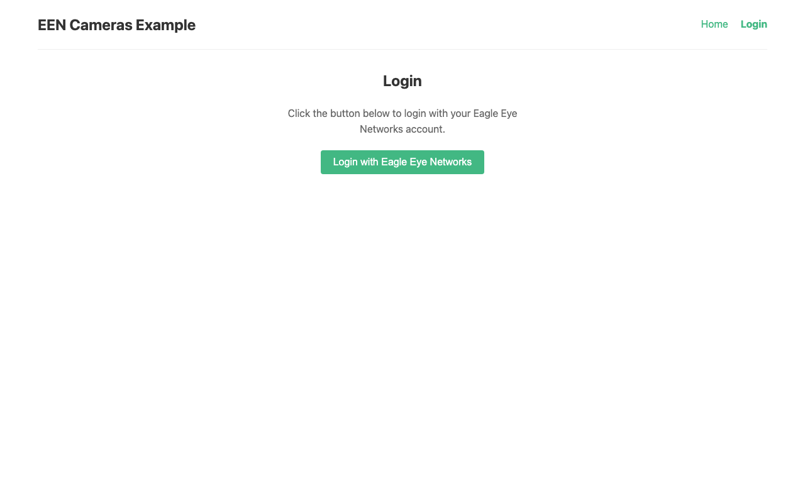

# EEN API Toolkit - Vue Cameras Example

A Vue 3 example demonstrating how to list and view EEN cameras using the een-api-toolkit.



## Features Demonstrated

- OAuth authentication flow (login, callback, logout)
- Protected routes with navigation guards
- `getCameras()` function for listing cameras with pagination
- `getCamera()` function for fetching camera details
- Status filtering (online, streaming, offline, device offline, bridge offline, error)
- Camera card grid with status badges
- Detailed camera view with device info

## APIs Used

- `getCameras()` - List cameras with filtering and pagination
- `getCamera()` - Get single camera by ID
- `useAuthStore()` - Authentication state management
- `initEenToolkit()` - Toolkit initialization

## Setup

### Prerequisites

1. **Start the OAuth proxy** (required for authentication):

   The OAuth proxy is a separate project that handles token management securely.
   Clone and run it from: https://github.com/klaushofrichter/een-oauth-proxy

   ```bash
   # In a separate terminal, from the een-oauth-proxy directory
   npm install
   npm run dev
   ```

   The proxy should be running at `http://localhost:8787`.

### Example Setup

All commands below should be run from this example directory (`examples/vue-cameras/`):

2. Copy the environment file:
   ```bash
   # From examples/vue-cameras/
   cp .env.example .env
   ```

3. Edit `.env` with your EEN credentials:
   ```env
   VITE_EEN_CLIENT_ID=your-client-id
   VITE_PROXY_URL=http://localhost:8787
   # DO NOT change the redirect URI - EEN IDP only permits this URL
   VITE_REDIRECT_URI=http://127.0.0.1:3333
   ```

4. Install dependencies and start:
   ```bash
   # From examples/vue-cameras/
   npm install
   npm run dev
   ```

   **Note:** `npm run dev` calls `npx kill-port 3333` before starting Vite, which will block for 10-15 seconds while it checks/clears the port.

5. Open http://127.0.0.1:3333 in your browser.

**Important:** The EEN Identity Provider only permits `http://127.0.0.1:3333` as the OAuth redirect URI. Do not use `localhost` or other ports.

## Project Structure

```
src/
├── main.ts          # App entry, toolkit initialization
├── App.vue          # Root component with navigation
├── router/
│   └── index.ts     # Vue Router with auth guards
└── views/
    ├── Home.vue     # Home page with login prompt
    ├── Login.vue    # OAuth login redirect
    ├── Callback.vue # OAuth callback handler
    ├── Cameras.vue  # Camera list with filtering
    ├── CameraDetail.vue # Single camera details
    └── Logout.vue   # Logout handler
```

## Key Code Examples

### Listing Cameras with Filtering (Cameras.vue)

```typescript
import { getCameras, type Camera, type ListCamerasParams } from 'een-api-toolkit'

const params = ref<ListCamerasParams>({
  pageSize: 20,
  include: ['deviceInfo', 'status']
})

async function fetchCameras() {
  const result = await getCameras(params.value)
  if (result.error) {
    error.value = result.error
  } else {
    cameras.value = result.data.results
    nextPageToken.value = result.data.nextPageToken
  }
}
```

### Fetching Camera Details (CameraDetail.vue)

```typescript
import { getCamera } from 'een-api-toolkit'

const result = await getCamera(cameraId, {
  include: ['deviceInfo', 'status']
})

if (result.error) {
  error.value = result.error
} else {
  camera.value = result.data
}
```

### Status Filtering

```typescript
// Watch for status filter changes
watch(statusFilter, async (newStatus) => {
  if (newStatus) {
    setParams({
      pageSize: 20,
      include: ['deviceInfo', 'status'],
      status__in: [newStatus]
    })
  }
  await fetchCameras()
})
```
