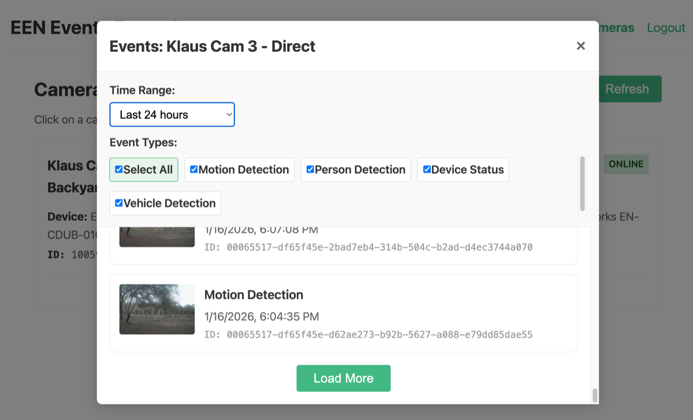

# EEN API Toolkit - Vue Events Example

A Vue 3 example demonstrating how to query and display events from EEN cameras using the een-api-toolkit.



## Features Demonstrated

- OAuth authentication flow (login, callback, logout)
- Protected routes with navigation guards
- `listEvents()` function for listing events with filters
- `listEventFieldValues()` function for discovering available event types per camera
- `listEventTypes()` function for getting human-readable event type names
- `getRecordedImage()` function for fetching event thumbnails
- Time range filtering (1 hour, 6 hours, 24 hours)
- Event type filtering with checkboxes
- Pagination with "Load More" button
- Camera grid with click-to-open events modal

## APIs Used

- `listEvents()` - List events with actor, type, and timestamp filters
- `listEventFieldValues()` - Get available event types for a specific camera
- `listEventTypes()` - Get human-readable names for event types
- `getRecordedImage()` - Fetch preview image at event timestamp
- `getCameras()` - List cameras for the camera grid
- `useAuthStore()` - Authentication state management
- `initEenToolkit()` - Toolkit initialization

## Setup

### Prerequisites

1. **Start the OAuth proxy** (required for authentication):

   The OAuth proxy is a separate project that handles token management securely.
   Clone and run it from: https://github.com/klaushofrichter/een-oauth-proxy

   ```bash
   # In a separate terminal, from the een-oauth-proxy directory
   npm install
   npm run dev
   ```

   The proxy should be running at `http://localhost:8787`.

### Example Setup

All commands below should be run from this example directory (`examples/vue-events/`):

2. Copy the environment file:
   ```bash
   # From examples/vue-events/
   cp .env.example .env
   ```

3. Edit `.env` with your EEN credentials:
   ```env
   VITE_EEN_CLIENT_ID=your-client-id
   VITE_PROXY_URL=http://localhost:8787
   # DO NOT change the redirect URI - EEN IDP only permits this URL
   VITE_REDIRECT_URI=http://127.0.0.1:3333
   ```

4. Install dependencies and start:
   ```bash
   # From examples/vue-events/
   npm install
   npm run dev
   ```

5. Open http://127.0.0.1:3333 in your browser.

**Important:** The EEN Identity Provider only permits `http://127.0.0.1:3333` as the OAuth redirect URI. Do not use `localhost` or other ports.

**Note:** Development and testing was done on macOS. The `npm run stop` command uses `lsof`, which is not available on Windows. Windows users should manually stop any process on port 3333 or use `npx kill-port 3333` instead.

## Project Structure

```
src/
├── main.ts          # App entry, toolkit initialization
├── App.vue          # Root component with navigation
├── router/
│   └── index.ts     # Vue Router with auth guards
├── components/
│   └── EventsModal.vue  # Events modal with filtering and thumbnails
└── views/
    ├── Home.vue     # Home page with login prompt
    ├── Login.vue    # OAuth login redirect
    ├── Callback.vue # OAuth callback handler
    ├── Cameras.vue  # Camera grid, click to view events
    └── Logout.vue   # Logout handler
```

## Key Code Examples

### Listing Events for a Camera (EventsModal.vue)

```typescript
import { listEvents, listEventFieldValues, type Event } from 'een-api-toolkit'

// Get available event types for this camera
const fieldValuesResult = await listEventFieldValues({
  actor: `camera:${cameraId}`
})
const availableEventTypes = fieldValuesResult.data?.type || []

// Fetch events with filters
const result = await listEvents({
  actor: `camera:${cameraId}`,
  type__in: selectedEventTypes,
  startTimestamp__gte: getStartTimestamp(timeRange),
  endTimestamp__lte: new Date().toISOString(),
  pageSize: 20,
  sort: '-startTimestamp'
})

if (result.error) {
  error.value = result.error
} else {
  events.value = result.data.results
  nextPageToken.value = result.data.nextPageToken
}
```

### Fetching Event Thumbnails

```typescript
import { getRecordedImage } from 'een-api-toolkit'

// Load preview image at event timestamp
const result = await getRecordedImage({
  deviceId: event.actorId,
  type: 'preview',
  timestamp__gte: event.startTimestamp
})

if (!result.error && result.data) {
  // Store base64 image data for display
  eventImages.value.set(event.id, result.data.imageData)
}
```

### Time Range Filtering

```typescript
function getStartTimestamp(range: TimeRange): string {
  const now = Date.now()
  const hoursMap: Record<TimeRange, number> = {
    '1h': 1,
    '6h': 6,
    '24h': 24
  }
  return new Date(now - hoursMap[range] * 60 * 60 * 1000).toISOString()
}
```

### Event Type Filtering

```typescript
// Fetch human-readable event type names
const result = await listEventTypes({ pageSize: 100 })
const eventTypeNames = new Map<string, string>()
if (!result.error && result.data) {
  for (const et of result.data.results) {
    eventTypeNames.set(et.type, et.name)
  }
}

// Display name for event type
function getEventTypeName(type: string): string {
  return eventTypeNames.get(type) || formatEventType(type)
}
```
