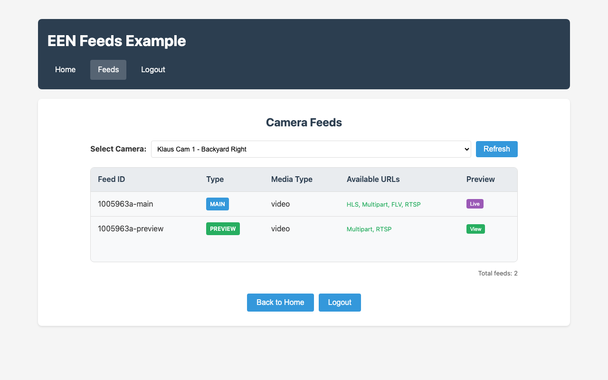

# EEN API Toolkit - Vue Feeds Example

A Vue 3 example demonstrating how to list camera feeds and display live video using the een-api-toolkit.



## Features Demonstrated

- OAuth authentication flow (login, callback, logout)
- Protected routes with navigation guards
- `getCameras()` function for listing cameras
- `listFeeds()` function for listing available feeds per camera
- `initMediaSession()` for cookie-based media authentication
- Live video preview using multipart URL streams
- Live Video SDK integration for WebCodecs-based streaming
- Feed type filtering (main, preview, talkdown)
- Modal-based video preview with multiple stream modes

## APIs Used

- `getCameras()` - List available cameras
- `listFeeds()` - List feeds with streaming URLs (HLS, Multipart, FLV, RTSP)
- `initMediaSession()` - Initialize session cookie for media access
- `useAuthStore()` - Authentication state management
- `initEenToolkit()` - Toolkit initialization

## Video Streaming Modes

This example demonstrates two different approaches to live video:

| Mode | Stream Type | Technology | Browser Support |
|------|-------------|------------|-----------------|
| **Preview** | Multipart URL | Session cookie + img tag | All modern browsers |
| **Live SDK** | WebCodecs | JWT + Live Video SDK | Chrome 94+, Edge 94+, Opera 80+ |

## Setup

### Prerequisites

1. **Start the OAuth proxy** (required for authentication):

   The OAuth proxy is a separate project that handles token management securely.
   Clone and run it from: https://github.com/klaushofrichter/een-oauth-proxy

   ```bash
   # In a separate terminal, from the een-oauth-proxy directory
   npm install
   npm run dev
   ```

   The proxy should be running at `http://localhost:8787`.

### Example Setup

All commands below should be run from this example directory (`examples/vue-feeds/`):

2. Copy the environment file:
   ```bash
   # From examples/vue-feeds/
   cp .env.example .env
   ```

3. Edit `.env` with your EEN credentials:
   ```env
   VITE_EEN_CLIENT_ID=your-client-id
   VITE_PROXY_URL=http://localhost:8787
   # DO NOT change the redirect URI - EEN IDP only permits this URL
   VITE_REDIRECT_URI=http://127.0.0.1:3333
   ```

4. Install dependencies and start:
   ```bash
   # From examples/vue-feeds/
   npm install
   npm run dev
   ```

5. Open http://127.0.0.1:3333 in your browser.

**Important:** The EEN Identity Provider only permits `http://127.0.0.1:3333` as the OAuth redirect URI. Do not use `localhost` or other ports.

## Project Structure

```
src/
├── main.ts          # App entry, toolkit initialization
├── App.vue          # Root component with navigation
├── router/
│   └── index.ts     # Vue Router with auth guards
└── views/
    ├── Home.vue     # Home page with login prompt
    ├── Login.vue    # OAuth login redirect
    ├── Callback.vue # OAuth callback handler
    ├── Feeds.vue    # Feed list with live preview
    └── Logout.vue   # Logout handler
```

## Key Code Examples

### Listing Feeds for a Camera (Feeds.vue)

```typescript
import { listFeeds, type Feed, type FeedIncludeOption } from 'een-api-toolkit'

const result = await listFeeds({
  deviceId: selectedCameraId.value,
  include: ['hlsUrl', 'multipartUrl', 'flvUrl', 'rtspUrl']
})

if (result.error) {
  error.value = result.error.message
} else {
  feeds.value = result.data?.results || []
}
```

### Initializing Media Session for Preview Streams

```typescript
import { initMediaSession } from 'een-api-toolkit'

async function initializeMediaSession() {
  const result = await initMediaSession()
  if (result.error) {
    mediaSessionError.value = result.error.message
    return false
  }
  mediaSessionInitialized.value = true
  return true
}
```

### Using Live Video SDK for Main Streams

```typescript
import LivePlayer from '@een/live-video-web-sdk'

async function initLivePlayer(feed: Feed) {
  const livePlayer = new LivePlayer()
  await livePlayer.start({
    videoElement: videoRef.value,
    cameraId: feed.deviceId,
    baseUrl: authStore.baseUrl,
    jwt: authStore.token
  })
}
```

### Displaying Multipart Preview Stream

```vue
<template>
  <!-- Multipart Image for preview mode -->
  
</template>
```
