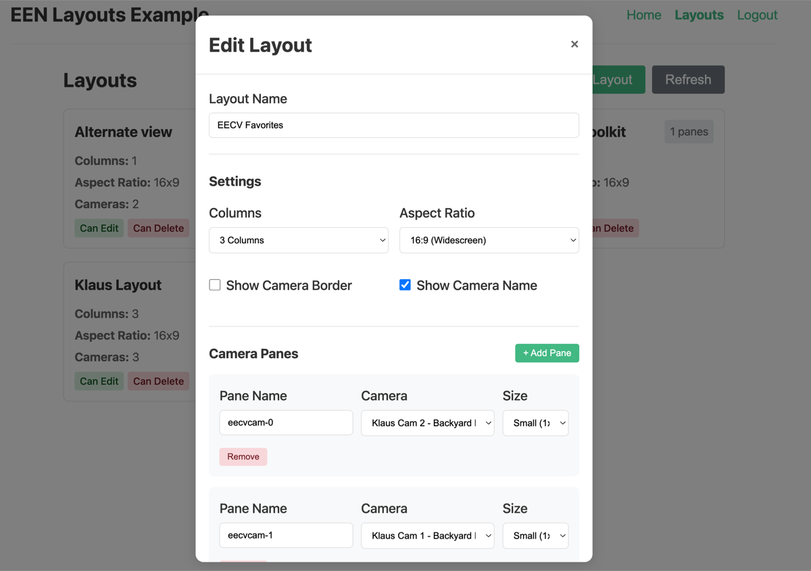

# EEN API Toolkit - Vue Layouts Example

A complete example showing how to use the Layouts API with een-api-toolkit in a Vue 3 application.



## Storage Strategy: Memory

This example uses the `memory` storage strategy for maximum security. This means:

- **Tokens are never written to disk** - immune to localStorage/sessionStorage XSS attacks
- **Page refresh requires re-authentication** - tokens exist only in memory
- **Each tab is independent** - opening a new tab requires separate login

This is the recommended strategy for high-security deployments where protecting against XSS token theft is critical.

## Features Demonstrated

- OAuth authentication flow (login, callback, logout)
- Protected routes with navigation guards
- `getLayouts()` function with pagination
- `createLayout()` function for creating new layouts
- `updateLayout()` function for modifying layouts
- `deleteLayout()` function for removing layouts
- Layout modal for create/edit operations
- Camera pane management within layouts
- Error handling with Result pattern
- Reactive authentication state

## APIs Used

- `getLayouts()` - List layouts with pagination and filtering
- `getLayout()` - Get a specific layout by ID
- `createLayout()` - Create a new layout
- `updateLayout()` - Update an existing layout
- `deleteLayout()` - Delete a layout
- `getCameras()` - Get cameras for pane selection
- `getCurrentUser()` - Get current user profile
- `useAuthStore()` - Authentication state management
- `getAuthUrl()` - Generate OAuth login URL
- `handleAuthCallback()` - Process OAuth callback
- `initEenToolkit()` - Toolkit initialization

## Setup

### Prerequisites

1. **Start the OAuth proxy** (required for authentication):

   The OAuth proxy is a separate project that handles token management securely.
   Clone and run it from: https://github.com/klaushofrichter/een-oauth-proxy

   ```bash
   # In a separate terminal, from the een-oauth-proxy directory
   npm install
   npm run dev
   ```

   The proxy should be running at `http://localhost:8787`.

### Example Setup

All commands below should be run from this example directory (`examples/vue-layouts/`):

2. Copy the environment file:
   ```bash
   # From examples/vue-layouts/
   cp .env.example .env
   ```

3. Edit `.env` with your EEN credentials:
   ```env
   VITE_EEN_CLIENT_ID=your-client-id
   VITE_PROXY_URL=http://localhost:8787
   # DO NOT change the redirect URI - EEN IDP only permits this URL
   VITE_REDIRECT_URI=http://127.0.0.1:3333
   ```

4. Install dependencies and start:
   ```bash
   # From examples/vue-layouts/
   npm install
   npm run dev
   ```

5. Open http://127.0.0.1:3333 in your browser.

**Important:** The EEN Identity Provider only permits `http://127.0.0.1:3333` as the OAuth redirect URI. Do not use `localhost` or other ports.

**Note:** Development and testing was done on macOS. The `npm run stop` command uses `lsof`, which is not available on Windows. Windows users should manually stop any process on port 3333 or use `npx kill-port 3333` instead.

## Project Structure

```
src/
├── main.ts              # App entry, toolkit initialization
├── App.vue              # Root component with navigation
├── router/
│   └── index.ts         # Vue Router with auth guards
├── views/
│   ├── Home.vue         # Home page with user profile
│   ├── Login.vue        # OAuth login redirect
│   ├── Callback.vue     # OAuth callback handler
│   ├── Layouts.vue      # Layout list with CRUD operations
│   └── Logout.vue       # Logout handler
└── components/
    └── LayoutModal.vue  # Modal for create/edit layouts
```

## Key Code Examples

### Initializing the Toolkit (main.ts)

```typescript
import { initEenToolkit } from 'een-api-toolkit'

initEenToolkit({
  proxyUrl: import.meta.env.VITE_PROXY_URL,
  clientId: import.meta.env.VITE_EEN_CLIENT_ID,
  storageStrategy: 'memory',  // Maximum security - tokens lost on refresh
  debug: true
})
```

### Fetching Layouts with Pagination (Layouts.vue)

```typescript
import { ref } from 'vue'
import { getLayouts, type Layout } from 'een-api-toolkit'

const layouts = ref<Layout[]>([])
const nextPageToken = ref<string | undefined>(undefined)
const loading = ref(false)

async function fetchLayouts() {
  loading.value = true
  const result = await getLayouts({
    pageSize: 20,
    include: ['effectivePermissions', 'resourceCounts']
  })

  if (result.error) {
    console.error('Failed to fetch layouts:', result.error.message)
  } else {
    layouts.value = result.data.results
    nextPageToken.value = result.data.nextPageToken
  }
  loading.value = false
}
```

### Creating a Layout

```typescript
import { createLayout, type CreateLayoutParams } from 'een-api-toolkit'

async function handleCreate(params: CreateLayoutParams) {
  const result = await createLayout({
    name: 'My New Layout',
    settings: {
      paneColumns: 2,
      cameraAspectRatio: '16x9',
      showCameraBorder: true,
      showCameraName: true
    },
    panes: []
  })

  if (result.error) {
    console.error('Failed to create layout:', result.error.message)
  } else {
    console.log('Created layout:', result.data.id)
    await fetchLayouts() // Refresh the list
  }
}
```

### Updating a Layout

```typescript
import { updateLayout, type UpdateLayoutParams } from 'een-api-toolkit'

async function handleUpdate(layoutId: string, params: UpdateLayoutParams) {
  const result = await updateLayout(layoutId, {
    name: 'Updated Layout Name',
    settings: {
      paneColumns: 3
    }
  })

  if (result.error) {
    console.error('Failed to update layout:', result.error.message)
  } else {
    await fetchLayouts() // Refresh the list
  }
}
```

### Deleting a Layout

```typescript
import { deleteLayout } from 'een-api-toolkit'

async function handleDelete(layoutId: string) {
  if (!confirm('Are you sure you want to delete this layout?')) return

  const result = await deleteLayout(layoutId)

  if (result.error) {
    console.error('Failed to delete layout:', result.error.message)
  } else {
    await fetchLayouts() // Refresh the list
  }
}
```

### Layout Modal Component (LayoutModal.vue)

```typescript
import { ref, watch } from 'vue'
import { getCameras, type Layout, type Camera, type LayoutPane } from 'een-api-toolkit'

const props = defineProps<{
  layout?: Layout | null
  isOpen: boolean
}>()

const emit = defineEmits<{
  save: [params: { name: string; settings: LayoutSettings; panes: LayoutPane[] }]
  delete: [layoutId: string]
  close: []
}>()

const cameras = ref<Camera[]>([])
const name = ref('')
const paneColumns = ref(2)
const panes = ref<LayoutPane[]>([])

// Fetch cameras for pane selection
async function fetchCameras() {
  const result = await getCameras({ pageSize: 100, include: ['status'] })
  if (!result.error) {
    cameras.value = result.data.results
  }
}

// Add a new pane
function addPane() {
  panes.value.push({
    id: panes.value.length,
    name: `Pane ${panes.value.length + 1}`,
    type: 'preview',
    size: 1,
    cameraId: ''
  })
}
```

### Auth Guard (router/index.ts)

```typescript
router.beforeEach((to, from, next) => {
  const authStore = useAuthStore()

  if (to.meta.requiresAuth && !authStore.isAuthenticated) {
    next('/login')
  } else {
    next()
  }
})
```

## Layout Types

```typescript
interface Layout {
  id: string
  name: string
  accountId: string
  panes: LayoutPane[]
  settings: LayoutSettings
  effectivePermissions?: LayoutPermissions
  resourceCounts?: { cameras?: number }
}

interface LayoutPane {
  id: number
  name: string
  type: 'preview' | 'compositePreview'
  size: 1 | 2 | 3
  cameraId: string
}

interface LayoutSettings {
  showCameraBorder: boolean
  showCameraName: boolean
  cameraAspectRatio: '16x9' | '4x3'
  paneColumns: number  // 1-6
}
```

## Running E2E Tests

The example includes Playwright E2E tests:

```bash
# Run all E2E tests
npm run test:e2e

# Run with UI for debugging
npm run test:e2e:ui
```

Tests cover:
- App loads correctly
- Navigation between pages
- Authentication flow
- Protected route redirection
- OAuth login flow (when proxy is available)
- Layouts page after authentication
