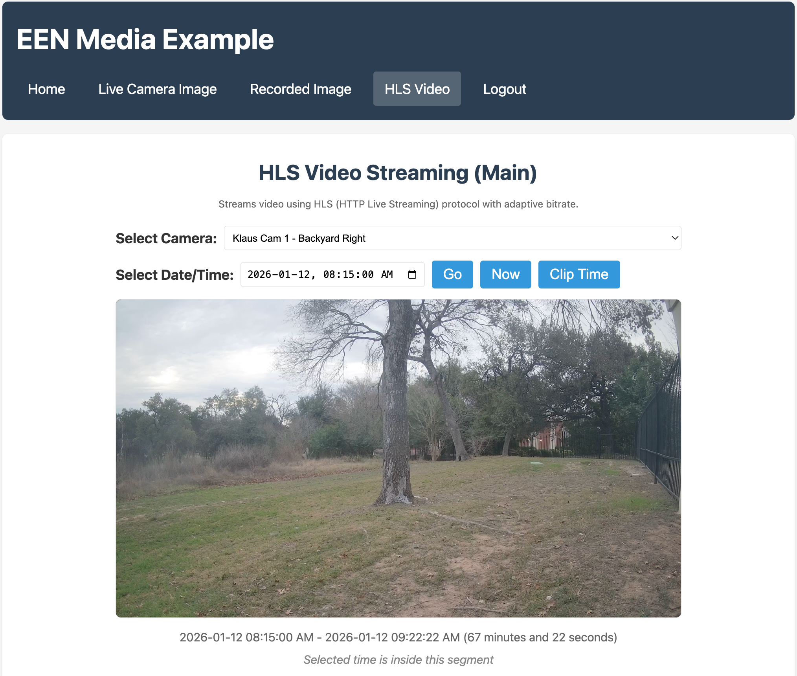

# EEN API Toolkit - Vue Media Example

A Vue 3 example demonstrating how to fetch live and recorded images from EEN cameras using the een-api-toolkit.



## Storage Strategy: sessionStorage

This example uses the `sessionStorage` storage strategy for balanced security. This means:

- **Per-tab isolation** - each browser tab has its own session
- **Page refresh preserves session** - tokens survive refresh within the same tab
- **Tab close clears session** - closing the tab removes tokens
- **New tabs require login** - opening a new tab requires separate authentication

This is a good balance between security (limiting XSS blast radius) and user experience (page refresh doesn't require re-login).

## Features Demonstrated

- OAuth authentication flow (login, callback, logout)
- Protected routes with navigation guards
- `getCameras()` function for listing cameras
- `getLiveImage()` function for fetching live preview images
- `getRecordedImage()` function for fetching recorded images with navigation
- Camera selection with persistence across pages
- Auto-refresh functionality for live images
- Time-based navigation for recorded images (prev/next)
- Image timestamp display

## APIs Used

- `getCameras()` - List available cameras
- `getLiveImage()` - Fetch live preview image as base64
- `getRecordedImage()` - Fetch recorded image at specific timestamp
- `useAuthStore()` - Authentication state management
- `initEenToolkit()` - Toolkit initialization

## Setup

### Prerequisites

1. **Start the OAuth proxy** (required for authentication):

   The OAuth proxy is a separate project that handles token management securely.
   Clone and run it from: https://github.com/klaushofrichter/een-oauth-proxy

   ```bash
   # In a separate terminal, from the een-oauth-proxy directory
   npm install
   npm run dev
   ```

   The proxy should be running at `http://localhost:8787`.

### Example Setup

All commands below should be run from this example directory (`examples/vue-media/`):

2. Copy the environment file:
   ```bash
   # From examples/vue-media/
   cp .env.example .env
   ```

3. Edit `.env` with your EEN credentials:
   ```env
   VITE_EEN_CLIENT_ID=your-client-id
   VITE_PROXY_URL=http://localhost:8787
   # DO NOT change the redirect URI - EEN IDP only permits this URL
   VITE_REDIRECT_URI=http://127.0.0.1:3333
   ```

4. Install dependencies and start:
   ```bash
   # From examples/vue-media/
   npm install
   npm run dev
   ```

5. Open http://127.0.0.1:3333 in your browser.

**Important:** The EEN Identity Provider only permits `http://127.0.0.1:3333` as the OAuth redirect URI. Do not use `localhost` or other ports.

**Note:** Development and testing was done on macOS. The `npm run stop` command uses `lsof`, which is not available on Windows. Windows users should manually stop any process on port 3333 or use `npx kill-port 3333` instead.

## Project Structure

```
src/
├── main.ts          # App entry, toolkit initialization
├── App.vue          # Root component with navigation
├── router/
│   └── index.ts     # Vue Router with auth guards
└── views/
    ├── Home.vue     # Home page with login prompt
    ├── Login.vue    # OAuth login redirect
    ├── Callback.vue # OAuth callback handler
    ├── LiveCamera.vue    # Live image viewer with auto-refresh
    ├── RecordedImage.vue # Recorded image viewer with navigation
    └── Logout.vue   # Logout handler
```

## Key Code Examples

### Fetching Live Images (LiveCamera.vue)

```typescript
import { getLiveImage, type LiveImageParams } from 'een-api-toolkit'

async function fetchLiveImage() {
  const result = await getLiveImage(selectedCameraId.value, {
    type: 'preview'
  })

  if (result.error) {
    error.value = result.error.message
  } else {
    imageData.value = result.data.image
    timestamp.value = result.data.timestamp
  }
}
```

### Auto-Refresh for Live Images

```typescript
let refreshInterval: number | null = null

function startAutoRefresh() {
  refreshInterval = window.setInterval(() => {
    fetchLiveImage()
  }, 2000) // Refresh every 2 seconds
}

function stopAutoRefresh() {
  if (refreshInterval) {
    clearInterval(refreshInterval)
    refreshInterval = null
  }
}
```

### Fetching Recorded Images (RecordedImage.vue)

```typescript
import { getRecordedImage, type RecordedImageParams } from 'een-api-toolkit'

async function fetchRecordedImage() {
  const result = await getRecordedImage(selectedCameraId.value, {
    timestamp__gte: selectedTimestamp.value,
    type: 'preview'
  })

  if (result.error) {
    error.value = result.error.message
  } else {
    imageData.value = result.data.image
    actualTimestamp.value = result.data.timestamp
    prevToken.value = result.data.prevToken
    nextToken.value = result.data.nextToken
  }
}
```

### Navigating Recorded Images

```typescript
async function navigateNext() {
  if (!nextToken.value) return

  const result = await getRecordedImage(selectedCameraId.value, {
    next: nextToken.value,
    type: 'preview'
  })

  if (!result.error) {
    imageData.value = result.data.image
    actualTimestamp.value = result.data.timestamp
    prevToken.value = result.data.prevToken
    nextToken.value = result.data.nextToken
  }
}
```

### Displaying Images

```vue
<template>
  
  <p v-if="timestamp">
    Timestamp: {{ new Date(timestamp).toLocaleString() }}
  </p>
</template>
```
