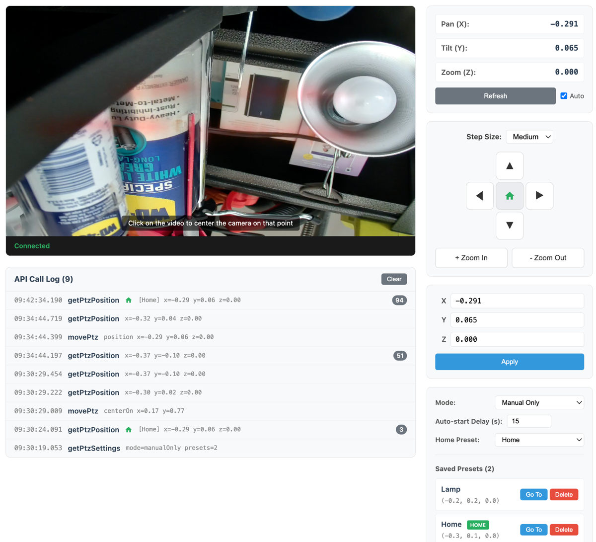

# EEN API Toolkit - Vue PTZ Example

A Vue 3 example demonstrating PTZ (Pan/Tilt/Zoom) camera control using the een-api-toolkit, including live video streaming, directional movement, click-to-center, absolute positioning, and preset management.



## Storage Strategy: sessionStorage

This example uses the `sessionStorage` storage strategy for balanced security. This means:

- **Per-tab isolation** - each browser tab has its own session
- **Page refresh preserves session** - tokens survive refresh within the same tab
- **Tab close clears session** - closing the tab removes tokens
- **New tabs require login** - opening a new tab requires separate authentication

This is a good balance between security (limiting XSS blast radius) and user experience (page refresh doesn't require re-login).

## Features Demonstrated

- OAuth authentication flow (login, callback, logout)
- Protected routes with navigation guards
- PTZ camera discovery (filters cameras by PTZ capability)
- Live video streaming via `@een/live-video-web-sdk`
- Click-to-center on the live video feed
- Direction pad with pan/tilt/zoom controls
- Absolute position input (pan, tilt, zoom, field of view)
- Current position display with auto-refresh
- Preset management (list, recall, create, delete, set home)
- Real-time API call logging

## Pages Overview

### Home Page
The landing page that displays a welcome message and login prompt when not authenticated. Shows the available toolkit functions and their descriptions.

### PTZ Control
The main control page with a two-column layout: live video on the left and PTZ controls on the right.

**Components:**

- **CameraSelector** - Discovers PTZ-capable cameras by checking each camera's capabilities and auto-selects the first one
- **LiveVideoPlayer** - Streams live video using the EEN Live Video Web SDK with click-to-center support
- **PositionDisplay** - Shows the current pan/tilt/zoom/field-of-view values with auto-refresh
- **DirectionPad** - Provides directional movement buttons (up/down/left/right, zoom in/out) and a home button
- **PositionInput** - Allows entering absolute pan/tilt/zoom/FOV values to move the camera
- **PresetManager** - Lists, recalls, creates, and deletes PTZ presets; designates a home preset
- **ApiLog** - Displays a real-time log of API calls made by the toolkit

## APIs Used Summary

| API Function | Component | Purpose |
|--------------|-----------|---------|
| `getCameras()` | CameraSelector | List available cameras |
| `getCamera()` | CameraSelector | Check PTZ capability per camera |
| `getPtzPosition()` | PositionDisplay | Read current camera position |
| `movePtz()` | DirectionPad, PositionInput, LiveVideoPlayer, PresetManager | Move camera (direction, position, centerOn) |
| `getPtzSettings()` | PresetManager | Retrieve presets and automation settings |
| `updatePtzSettings()` | PresetManager | Create/delete presets, set home preset |
| `getCurrentUser()` | App.vue | Fetch logged-in user profile for header display |
| `useAuthStore()` | Multiple | Authentication state management |
| `getAuthUrl()` | Login | Generate OAuth login URL |
| `handleAuthCallback()` | Callback | Process OAuth callback |
| `revokeToken()` | Logout | Revoke authentication token on logout |
| `initEenToolkit()` | App initialization | Configure toolkit settings |
| `getStorageStrategy()` | Home | Get the current storage strategy |
| `STORAGE_STRATEGY_DESCRIPTIONS` | Home | Human-readable storage strategy descriptions |

## Setup

### Prerequisites

1. **Start the OAuth proxy** (required for authentication):

   The OAuth proxy is a separate project that handles token management securely.
   Clone and run it from: https://github.com/klaushofrichter/een-oauth-proxy

   ```bash
   # In a separate terminal, from the een-oauth-proxy directory
   npm install
   npm run dev
   ```

   The proxy should be running at `http://localhost:8787`.

### Example Setup

All commands below should be run from this example directory (`examples/vue-ptz/`):

2. Copy the environment file:
   ```bash
   # From examples/vue-ptz/
   cp .env.example .env
   ```

3. Edit `.env` with your EEN credentials:
   ```env
   VITE_EEN_CLIENT_ID=your-client-id
   VITE_PROXY_URL=http://127.0.0.1:8787
   # DO NOT change the redirect URI - EEN IDP only permits this URL
   VITE_REDIRECT_URI=http://127.0.0.1:3333
   ```

4. Install dependencies and start:
   ```bash
   # From examples/vue-ptz/
   npm install
   npm run dev
   ```

5. Open http://127.0.0.1:3333 in your browser.

**Important:** The EEN Identity Provider only permits `http://127.0.0.1:3333` as the OAuth redirect URI. Do not use `localhost` or other ports.

**Note:** Development and testing was done on macOS. The `npm run stop` command uses `lsof`, which is not available on Windows. Windows users should manually stop any process on port 3333 or use `npx kill-port 3333` instead.

## Project Structure

```
src/
├── main.ts              # App entry, toolkit initialization
├── App.vue              # Root component with navigation and user info
├── router/
│   └── index.ts         # Vue Router with auth guards
├── composables/
│   └── useApiLog.ts     # Shared API call log state
├── components/
│   ├── CameraSelector.vue    # PTZ camera discovery and selection
│   ├── LiveVideoPlayer.vue   # Live video stream with click-to-center
│   ├── DirectionPad.vue      # Directional movement controls
│   ├── PositionDisplay.vue   # Current position readout
│   ├── PositionInput.vue     # Absolute position input form
│   ├── PresetManager.vue     # Preset CRUD and home preset
│   └── ApiLog.vue            # Real-time API call log
└── views/
    ├── Home.vue         # Home page with login prompt
    ├── Login.vue        # OAuth login redirect
    ├── Callback.vue     # OAuth callback handler
    ├── PtzControl.vue   # Main PTZ control page
    └── Logout.vue       # Logout handler
```

## Key Code Examples

### Moving a PTZ Camera (DirectionPad.vue)

```typescript
import { movePtz } from 'een-api-toolkit'

// Move camera using relative direction
const result = await movePtz(cameraId, {
  direction: { horizontal: 1, vertical: 0 }  // pan right
})

// Move camera to absolute position
const result = await movePtz(cameraId, {
  position: { pan: 90, tilt: 15, zoom: 2.5 }
})
```

### Click-to-Center (LiveVideoPlayer.vue)

```typescript
import { movePtz } from 'een-api-toolkit'

// Click coordinates on the video trigger centerOn move
const result = await movePtz(cameraId, {
  centerOn: { x: clickX, y: clickY, videoWidth, videoHeight }
})
```

### Managing Presets (PresetManager.vue)

```typescript
import { getPtzSettings, updatePtzSettings } from 'een-api-toolkit'

// List presets
const result = await getPtzSettings(cameraId)
const presets = result.data?.presets || []

// Recall a preset (move to its saved position)
await movePtz(cameraId, { position: preset.position })

// Create a new preset at the current position
await updatePtzSettings(cameraId, {
  presets: [...existingPresets, { name: 'New Preset' }]
})
```

### Reading Camera Position (PositionDisplay.vue)

```typescript
import { getPtzPosition } from 'een-api-toolkit'

const result = await getPtzPosition(cameraId)
if (result.data) {
  const { pan, tilt, zoom, fieldOfView } = result.data
}
```

### PTZ Camera Discovery (CameraSelector.vue)

```typescript
import { getCameras, getCamera } from 'een-api-toolkit'

// Fetch all cameras, then check each for PTZ capability
const result = await getCameras({ pageSize: 100 })
for (const cam of result.data?.results || []) {
  const detail = await getCamera(cam.id, { include: ['capabilities'] })
  if (detail.data?.capabilities?.ptz?.capable) {
    ptzCameras.push(detail.data)
  }
}
```
