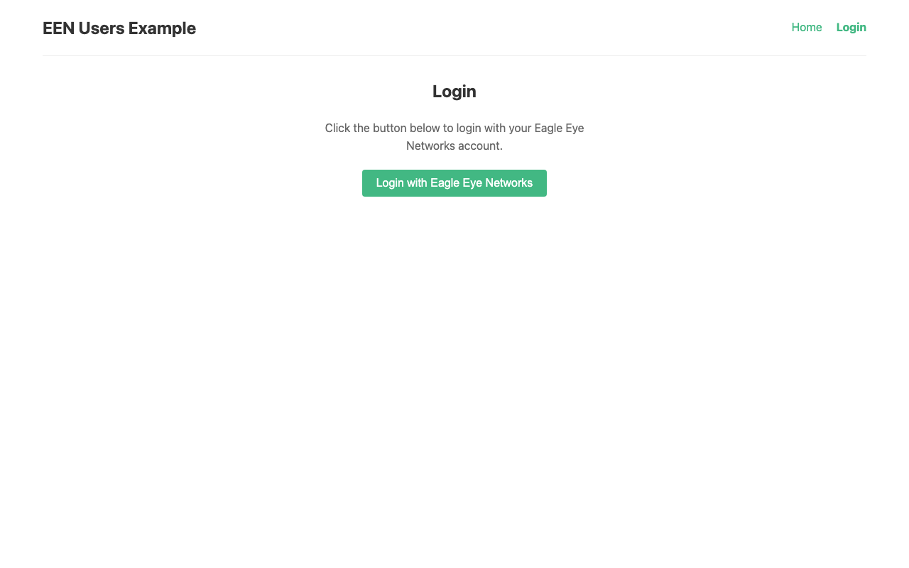

# EEN API Toolkit - Vue Users Example

A complete example showing how to use the een-api-toolkit in a Vue 3 application.



## Features Demonstrated

- OAuth authentication flow (login, callback, logout)
- Protected routes with navigation guards
- `getCurrentUser()` function for current user profile
- `getUsers()` function with pagination
- Error handling with Result pattern
- Reactive authentication state

## APIs Used

- `getUsers()` - List users with pagination
- `getCurrentUser()` - Get current user profile
- `useAuthStore()` - Authentication state management
- `getAuthUrl()` - Generate OAuth login URL
- `handleAuthCallback()` - Process OAuth callback
- `initEenToolkit()` - Toolkit initialization

## Setup

### Prerequisites

1. **Start the OAuth proxy** (required for authentication):

   The OAuth proxy is a separate project that handles token management securely.
   Clone and run it from: https://github.com/klaushofrichter/een-oauth-proxy

   ```bash
   # In a separate terminal, from the een-oauth-proxy directory
   npm install
   npm run dev
   ```

   The proxy should be running at `http://localhost:8787`.

### Example Setup

All commands below should be run from this example directory (`examples/vue-users/`):

2. Copy the environment file:
   ```bash
   # From examples/vue-users/
   cp .env.example .env
   ```

3. Edit `.env` with your EEN credentials:
   ```env
   VITE_EEN_CLIENT_ID=your-client-id
   VITE_PROXY_URL=http://localhost:8787
   # DO NOT change the redirect URI - EEN IDP only permits this URL
   VITE_REDIRECT_URI=http://127.0.0.1:3333
   ```

4. Install dependencies and start:
   ```bash
   # From examples/vue-users/
   npm install
   npm run dev
   ```

5. Open http://127.0.0.1:3333 in your browser.

**Important:** The EEN Identity Provider only permits `http://127.0.0.1:3333` as the OAuth redirect URI. Do not use `localhost` or other ports.

**Note:** Development and testing was done on macOS. The `npm run stop` command uses `lsof`, which is not available on Windows. Windows users should manually stop any process on port 3333 or use `npx kill-port 3333` instead.

## Project Structure

```
src/
├── main.ts          # App entry, toolkit initialization
├── App.vue          # Root component with navigation
├── router/
│   └── index.ts     # Vue Router with auth guards
└── views/
    ├── Home.vue     # Home page with user profile
    ├── Login.vue    # OAuth login redirect
    ├── Callback.vue # OAuth callback handler
    ├── Users.vue    # User list with pagination
    └── Logout.vue   # Logout handler
```

## Key Code Examples

### Initializing the Toolkit (main.ts)

```typescript
import { initEenToolkit } from 'een-api-toolkit'

initEenToolkit({
  proxyUrl: import.meta.env.VITE_PROXY_URL,
  clientId: import.meta.env.VITE_EEN_CLIENT_ID,
  debug: true
})
```

### OAuth Login (Login.vue)

```typescript
import { getAuthUrl } from 'een-api-toolkit'

function login() {
  window.location.href = getAuthUrl()
}
```

### OAuth Callback (Callback.vue)

```typescript
import { handleAuthCallback } from 'een-api-toolkit'

const url = new URL(window.location.href)
const code = url.searchParams.get('code')
const state = url.searchParams.get('state')

const { error } = await handleAuthCallback(code, state)
if (error) {
  // Handle error
} else {
  router.push('/dashboard')
}
```

### Fetching Users with Pagination (Users.vue)

```typescript
import { ref, computed } from 'vue'
import { getUsers, type User, type ListUsersParams } from 'een-api-toolkit'

const users = ref<User[]>([])
const nextPageToken = ref<string | undefined>(undefined)
const hasNextPage = computed(() => !!nextPageToken.value)

async function fetchUsers(params: ListUsersParams) {
  const result = await getUsers(params)
  if (result.error) {
    // Handle error
  } else {
    users.value = result.data.results
    nextPageToken.value = result.data.nextPageToken
  }
}

async function fetchNextPage() {
  if (!nextPageToken.value) return
  const result = await getUsers({ pageSize: 10, pageToken: nextPageToken.value })
  if (!result.error) {
    users.value = [...users.value, ...result.data.results]
    nextPageToken.value = result.data.nextPageToken
  }
}
```

### Fetching Current User (Home.vue)

```typescript
import { getCurrentUser, type UserProfile } from 'een-api-toolkit'

const user = ref<UserProfile | null>(null)

async function fetchUser() {
  const result = await getCurrentUser()
  if (result.error) {
    // Handle error
  } else {
    user.value = result.data
  }
}
```

### Auth Guard (router/index.ts)

```typescript
router.beforeEach((to, from, next) => {
  const authStore = useAuthStore()

  if (to.meta.requiresAuth && !authStore.isAuthenticated) {
    next('/login')
  } else {
    next()
  }
})
```
